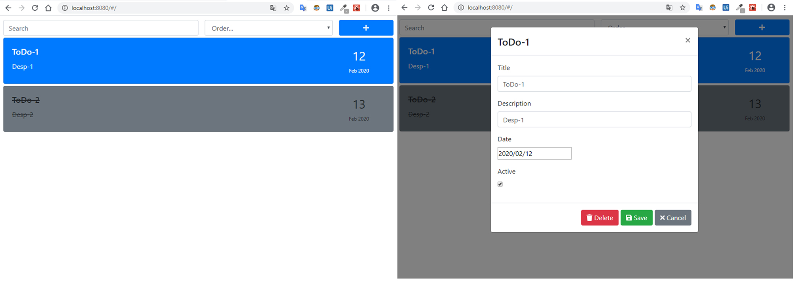

# reactjs-simple-todolist
Simple To Do List with Reactjs

## Features
1. Create, update, remove to do elements
2. Search in to do list
3. Sort the list by date

## Installing Packages

> npm install

## Start

> npm start

## Keywords
- react
- react hooks
- redux
- bootstrap
- webpack
- babel
